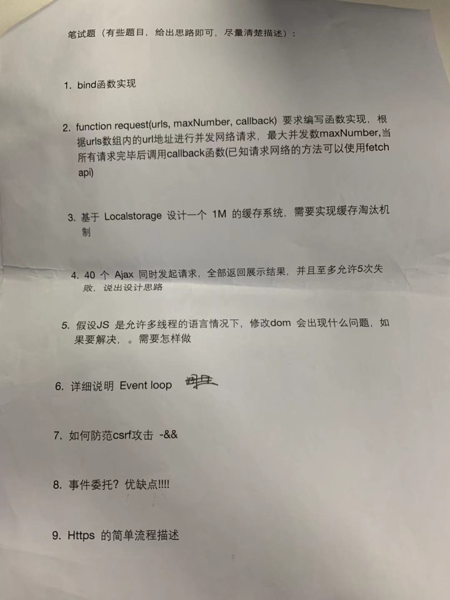
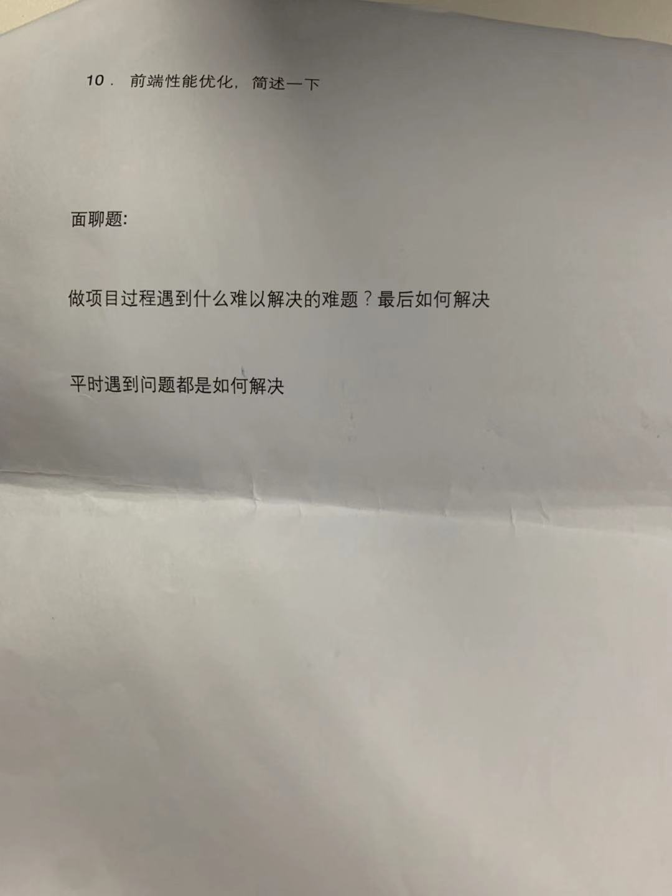

# Q




# A
```js
// 1、实现一个 bind 函数

function bind1(func, obj) {
  return (...rest) => {
    func.call(obj, ...rest);
  };
}

// or

function bind2(func, obj) {
  const fn = Symbol('fn');
  return (...rest) => {
    obj[fn] = func;
    obj[fn]();
    delete obj[fn];
  };
}

// 2

function request(urls, maxNumber, callback) {
  const responses = [];
  const reqCount = urls.length;
  const timerId = setInterval(() => {
    while (urls.length && maxNumber) {
      maxNumber--;
      const urlItem = urls.pop();
      fetch(urlItem.path, urlItem.option).then(res => {
        responses.push(res);
        maxNumber++;
      });
    }
    if (urls.length <= 0 && reqCount === responses.length) {
      clearInterval(timerId);
      callback(responses);
    }
  }, 100);
}

// 3
class LocalStorage1MCache {
  constructor() {
    this.name = "1MCache" + Math.random() * 100000000 + Date.now();
    this.keysIndexArray = [];
  }
  getSelf() {
    return JSON.parse(localStorage.getItem(this.name) || "{}");
  }
  setItem(key, val) {
    const _1MCache = this.getSelf();
    _1MCache[key] = val;
    localStorage.setItem(this.name, JSON.stringify(_1MCache));
    this.keysIndexArray.push(key);
    while (this.size() / 1024 > 1) {
      this.removeItem(this.keysIndexArray[0]);
    };
  }
  getItem(key) {
    return this.getSelf()[key];
  }
  removeItem(key) {
    const _1MCache = this.getSelf();
    _1MCache[key] = undefined;
    delete _1MCache[key];
    localStorage.setItem(this.name, JSON.stringify(_1MCache));
    this.keysIndexArray.splice(this.keysIndexArray.indexOf(key), 1);
  }
  size() {
    return JSON.stringify(this.getSelf()).length;
  }
}
// 4
function ajaxReq40(urls, callback) {
  let errorArr = [];
  let successArr = [];
  urls.forEach(url => {
    return fetch(url).then(
      res => {
        successArr.push(res);
        if (errorArr.length + successArr.length >= urls.length) {
          callback(successArr, errorArr);
        }
      },
      error => {
        errorArr.push(error);
        if (errorArr.length >= 5) {
          throw new Error("失败的网络请求超过5个");
        }
        if (errorArr.length + successArr.length >= urls.length) {
          callback(successArr, errorArr);
        }
      }
    );
  });
}

// 5
// 假如js是多线程 修改ui会出现的问题有 数据安全问题 （也就是异步）

// 解决办法 将修改ui的方式变成一个统一的接口 接口被占用时加锁

// 6

/***
宏任务：包括整体代码script，setTimeout，setInterval
微任务：Promise.then(非new Promise)，process.nextTick(node中)

事件的执行顺序，是先执行宏任务，然后执行微任务，这个是基础，任务可以有同步任务和异步任务，同步的进入主线程，
异步的进入Event Table并注册函数，异步事件完成后，会将回调函数放入Event Queue中(宏任务和微任务是不同的Event Queue)，
同步任务执行完成后，会从Event Queue中读取事件放入主线程执行，回调函数中可能还会包含不同的任务，因此会循环执行上述操作。
 */

// 7

// 不使用cookie验证 或者双重验证 cookie + token 或者其他不能伪造的

// 8

// 优点：1、减少事件注册 2、节省内存 3、简化dom事件结构

// 缺点：1、只支持基于冒泡的事件 2、层级过多有可能被阻止 3、代理可能造成不必要的响应或者误判

// 9

// https://www.jianshu.com/p/b0b6b88fe9fe

// 10

// 说来话长

```